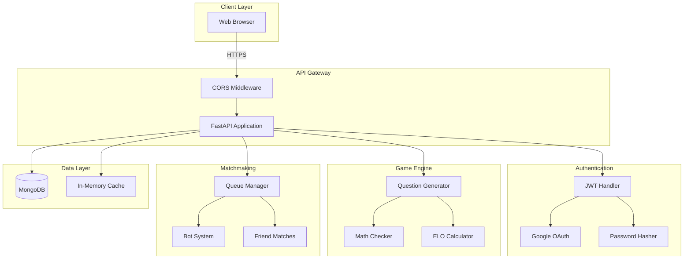

# 🏗️ System Architecture

## Overview

Derivative Duel is a competitive mathematics game where players solve derivative problems in real-time battles. The backend is built with FastAPI and MongoDB, designed for scalability and real-time gameplay.

## High-Level Architecture

```
┌─────────────────────────────────────────────────────────────┐
│                         Frontend                             │
│              (React/Next.js - Separate Repo)                 │
└─────────────────────┬───────────────────────────────────────┘
                      │ HTTPS/REST API
                      │ JWT Authentication
                      ▼
┌─────────────────────────────────────────────────────────────┐
│                      FastAPI Backend                         │
│                      (This Repository)                       │
├─────────────────────────────────────────────────────────────┤
│  ┌─────────────┐  ┌──────────────┐  ┌─────────────────┐   │
│  │   Auth      │  │  Game Logic  │  │  Matchmaking    │   │
│  │   Layer     │  │   Engine     │  │    System       │   │
│  └──────┬──────┘  └──────┬───────┘  └────────┬────────┘   │
│         │                 │                    │             │
│         └─────────────────┴────────────────────┘             │
│                           │                                  │
├───────────────────────────┼──────────────────────────────────┤
│                           ▼                                  │
│                   MongoDB Database                           │
│    ┌──────────┬──────────┬──────────┬───────────────┐      │
│    │  Users   │ Matches  │ Rounds   │   Challenges  │      │
│    └──────────┴──────────┴──────────┴───────────────┘      │
└─────────────────────────────────────────────────────────────┘
```

## Component Diagram



## Data Flow

### 1. User Authentication Flow

```
┌──────┐    ┌─────────┐    ┌──────────┐    ┌─────────┐
│Client│    │ FastAPI │    │  Google  │    │ MongoDB │
└──┬───┘    └────┬────┘    └────┬─────┘    └────┬────┘
   │             │              │               │
   │ POST /auth/google         │               │
   ├────────────>│              │               │
   │             │ Verify Token │               │
   │             ├─────────────>│               │
   │             │<─────────────┤               │
   │             │   User Info  │               │
   │             │              │               │
   │             │    Check/Create User         │
   │             ├──────────────────────────────>│
   │             │<──────────────────────────────┤
   │             │         User Data             │
   │             │              │               │
   │ JWT Token   │              │               │
   │<────────────┤              │               │
   │             │              │               │
```

### 2. Matchmaking Flow

```
Player A                    Server                      Player B
   │                          │                            │
   │ POST /api/game/start     │                            │
   ├─────────────────────────>│                            │
   │ {mode: "random"}         │                            │
   │                          │                            │
   │                          │<───────────────────────────┤
   │                          │  POST /api/game/start      │
   │                          │  {mode: "random"}          │
   │                          │                            │
   │                          │──── Match Found ────       │
   │                          │  (ELO-based pairing)       │
   │                          │                            │
   │ Match Details            │                            │
   │<─────────────────────────┤                            │
   │                          ├───────────────────────────>│
   │                          │          Match Details     │
   │                          │                            │
   │ GET /api/game/match/{id} │                            │
   ├─────────────────────────>│                            │
   │ Question Data            │                            │
   │<─────────────────────────┤                            │
```

### 3. Game Round Flow

```
┌──────────────────────────────────────────────────────┐
│ 1. Match starts                                      │
│    - Generate question based on average player ELO   │
│    - Both players receive same question              │
└────────────────────┬─────────────────────────────────┘
                     │
                     ▼
┌──────────────────────────────────────────────────────┐
│ 2. Players submit answers                            │
│    - POST /api/game/answer                           │
│    - SymPy validates mathematical equivalence        │
│    - Track submission time                           │
└────────────────────┬─────────────────────────────────┘
                     │
                     ▼
┌──────────────────────────────────────────────────────┐
│ 3. Round resolution                                  │
│    - Both correct: Faster player wins                │
│    - One correct: That player wins                   │
│    - Both wrong: Both lose, no ELO change            │
└────────────────────┬─────────────────────────────────┘
                     │
                     ▼
┌──────────────────────────────────────────────────────┐
│ 4. Update state                                      │
│    - Calculate ELO changes                           │
│    - Update win/loss records                         │
│    - Save to MongoDB                                 │
└──────────────────────────────────────────────────────┘
```

## Database Schema

### Users Collection
```javascript
{
  "_id": ObjectId,
  "email": String,           // Unique
  "name": String,
  "username": String,        // Unique, optional
  "google_id": String,       // For OAuth users
  "password": String,        // Hashed, for email/password users
  "elo": Number,             // Default: 500
  "wins": Number,            // Default: 0
  "losses": Number,          // Default: 0
  "time_trial_best": Number, // Best time trial score
  "created_at": DateTime
}
```

### Matches Collection
```javascript
{
  "_id": ObjectId,
  "player1_id": String,
  "player2_id": String,
  "mode": String,              // "random", "bot", "friend"
  "status": String,            // "waiting", "active", "completed"
  "match_code": String,        // For friend matches
  "current_round": Number,
  "player1_score": Number,
  "player2_score": Number,
  "player1_elo_before": Number,
  "player2_elo_before": Number,
  "player1_elo_after": Number,
  "player2_elo_after": Number,
  "winner_id": String,
  "created_at": DateTime,
  "completed_at": DateTime
}
```

### Rounds Collection
```javascript
{
  "_id": ObjectId,
  "match_id": String,
  "round_number": Number,
  "expression": String,
  "derivative": String,
  "difficulty": Number,        // 1-3
  "player1_answer": String,
  "player2_answer": String,
  "player1_correct": Boolean,
  "player2_correct": Boolean,
  "player1_time": Number,      // Milliseconds
  "player2_time": Number,
  "winner_id": String,
  "created_at": DateTime
}
```

### Daily Challenges Collection
```javascript
{
  "_id": ObjectId,
  "date": String,              // ISO date string
  "expression": String,
  "derivative": String,
  "answer": String,
  "difficulty": Number
}
```

### Daily Completions Collection
```javascript
{
  "_id": ObjectId,
  "user_id": String,
  "date": String,
  "time": Number,              // Completion time in seconds
  "correct": Boolean,
  "rank": Number,              // Position on leaderboard
  "created_at": DateTime
}
```

## Key Algorithms

### 1. ELO Rating System

**Formula:**
```
Expected Score (E) = 1 / (1 + 10^((opponent_elo - player_elo) / 400))
Rating Change (ΔR) = K × (Actual Score - Expected Score)
```

**K-Factor (Dynamic):**
- ELO < 1200: K = 40 (rapid improvement for beginners)
- ELO 1200-1800: K = 32 (moderate adjustment)
- ELO > 1800: K = 24 (stable for experts)

**Example:**
```
Player A: 1200 ELO wins against Player B: 1400 ELO
Expected: 0.24 (24% chance to win)
Change: 32 × (1 - 0.24) = 24 points
Result: A gains +24, B loses -24
```

### 2. Math Equivalence Checking

Uses SymPy with multiple strategies:

```python
1. Direct simplification: simplify(user - correct) == 0
2. Polynomial expansion: expand(user) == expand(correct)
3. Trigonometric simplification: trigsimp(user) == trigsimp(correct)
4. Logarithmic combination: logcombine(user) == logcombine(correct)
5. Symbolic equality: user.equals(correct)
```

**Transformations:**
- Replace Unicode: · → *, × → *, ^ → **
- Implicit multiplication: 2x → 2*x
- Function exponentiation: sin²(x) → sin(x)**2

### 3. Question Generation

**Difficulty Tiers:**

| ELO Range   | Difficulty | Question Types                          |
|-------------|------------|-----------------------------------------|
| < 1200      | Easy/Mixed | Simple polynomials (degree 2-3)         |
| 1200-1500   | Medium     | Higher polynomials, basic trig, exp, ln |
| > 1500      | Hard       | Chain rule, product/quotient rule       |

**Examples:**
- **Easy:** `2x³ + 3x² - 4x` → `6x² + 6x - 4`
- **Medium:** `sin(2x)` → `2·cos(2x)`
- **Hard:** `e^(x²)` → `2x·e^(x²)`

### 4. Matchmaking Algorithm

```python
1. Player joins queue with ELO rating
2. Wait for opponent (max 10 seconds)
3. If opponent found:
   - Pair with closest ELO (no restriction)
   - Create match with average ELO difficulty
4. If timeout:
   - Create bot match
   - Bot difficulty scales with player ELO
   - Bot time limit: varies by difficulty
```

## Security Considerations

### Authentication
- **JWT Tokens:** HS256 algorithm, 7-day expiration
- **Password Storage:** Bcrypt hashing with automatic salting
- **Google OAuth:** ID token verification with Google APIs

### API Security
- **CORS:** Whitelist-based origin checking
- **Input Validation:** Pydantic models for all inputs
- **SQL Injection:** N/A (MongoDB with Motor driver)
- **Rate Limiting:** TODO (future enhancement)

### Environment Variables
- All secrets in `.env` (gitignored)
- No hardcoded credentials in code
- Production uses environment-specific configs

## Performance Characteristics

### Current Performance
- **Question Generation:** ~5ms per question
- **Math Validation:** ~10-50ms depending on complexity
- **Database Queries:** ~10-30ms (indexed fields)
- **ELO Calculation:** <1ms

### Scalability Considerations
- **Vertical:** Single process handles ~1000 concurrent users
- **Horizontal:** Stateless design allows multiple instances
- **Database:** MongoDB Atlas auto-scaling
- **Caching:** In-memory daily challenges (reduces DB load)

### Bottlenecks
1. **Main.py Size:** 2546 lines (parsing overhead)
2. **Synchronous SymPy:** Blocks event loop
3. **In-memory Queue:** Doesn't scale across processes

### Future Optimizations
- [ ] Modularize codebase
- [ ] Async SymPy wrapper
- [ ] Redis for matchmaking queue
- [ ] WebSocket for real-time updates
- [ ] CDN for static content
- [ ] Database connection pooling

## Deployment Architecture

```
┌─────────────────────────────────────────────────┐
│              Render.com PaaS                    │
├─────────────────────────────────────────────────┤
│  ┌──────────────────────────────────────────┐  │
│  │   FastAPI App (uvicorn)                  │  │
│  │   - Auto-deploy from GitHub              │  │
│  │   - Environment variables                │  │
│  │   - Health checks                        │  │
│  └──────────────────────────────────────────┘  │
└─────────────────┬───────────────────────────────┘
                  │
                  ▼
┌─────────────────────────────────────────────────┐
│           MongoDB Atlas (Cloud)                 │
│  - Automatic backups                            │
│  - High availability                            │
│  - Geographic redundancy                        │
└─────────────────────────────────────────────────┘
```

## Technology Choices & Rationale

| Technology | Rationale |
|------------|-----------|
| **FastAPI** | Modern, fast, auto-generated API docs, async support |
| **MongoDB** | Flexible schema, good for game data, easy scaling |
| **SymPy** | Industry-standard symbolic math, comprehensive equivalence checking |
| **JWT** | Stateless authentication, scales horizontally |
| **Bcrypt** | Proven password hashing, automatic salting |
| **Motor** | Async MongoDB driver, non-blocking I/O |
| **Pydantic** | Runtime type checking, data validation |

## Future Architecture Evolution

### Phase 1: Modularization (Current)
- Single `main.py` file
- In-memory + MongoDB hybrid storage

### Phase 2: Microservices (Planned)
- Separate auth, game, matchmaking services
- Redis for real-time state
- WebSocket server for live updates

### Phase 3: Scale (Future)
- Kubernetes orchestration
- Load balancing
- Distributed caching
- CDN integration
- Analytics pipeline

---

**Last Updated:** February 2026  
**Version:** 1.0.0
